# Claude Code Integration Architecture Diagrams

> **Rendering**: These diagrams use Mermaid syntax. View in GitHub, VS Code with Mermaid extension, or any Mermaid-compatible renderer.

---

## 1. Complete System Architecture

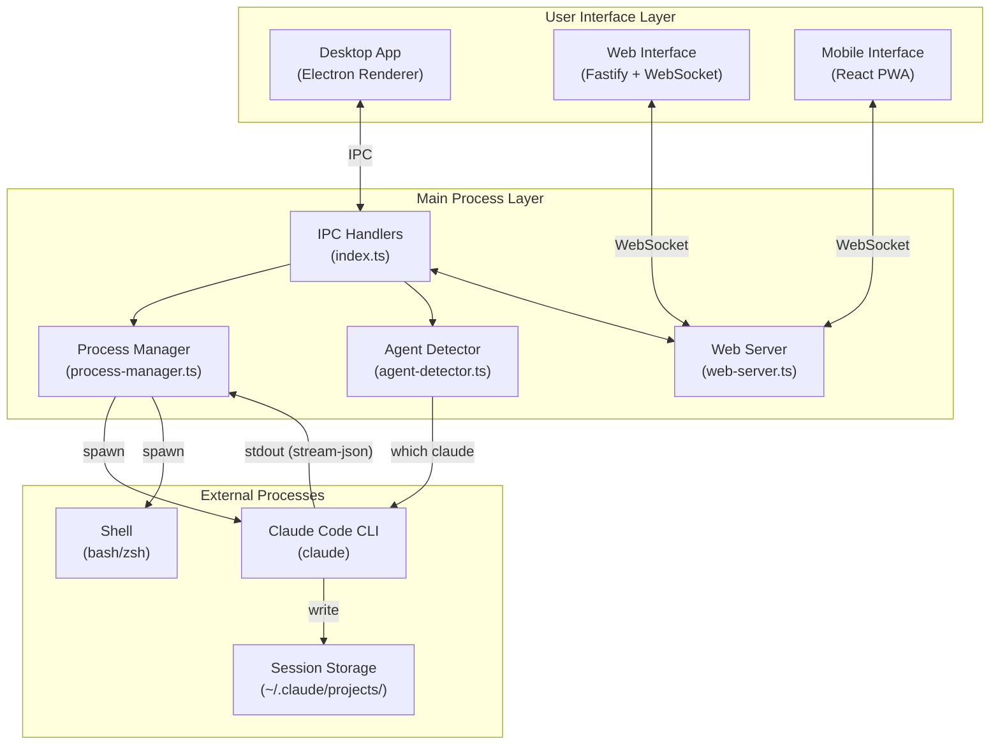

---

## 2. Process Spawn Decision Flow

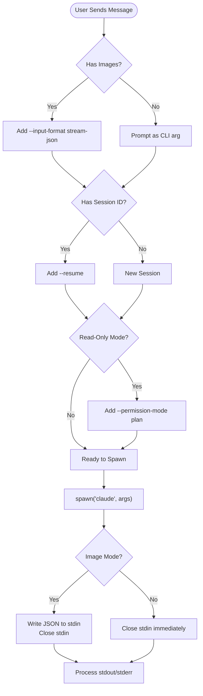

---

## 3. Stream-JSON Output Processing Pipeline

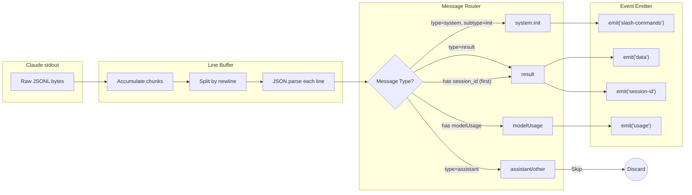

---

## 4. Multi-Tab Session State

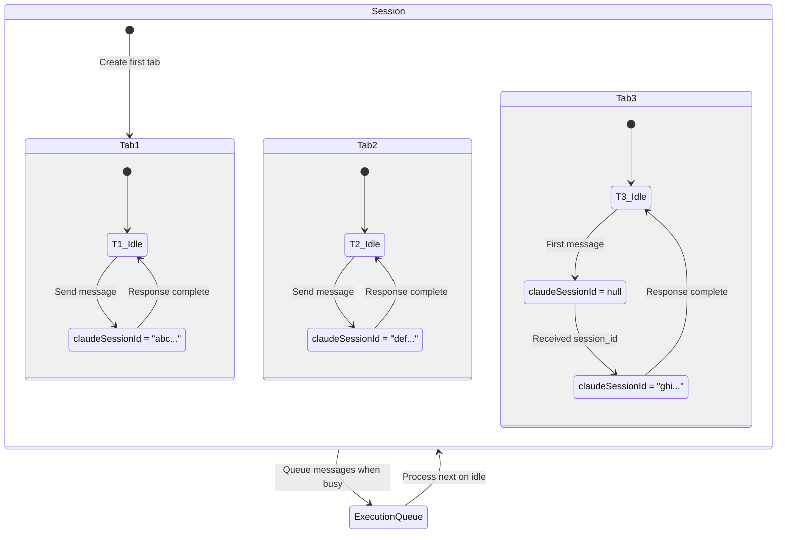

---

## 5. Session ID Lifecycle

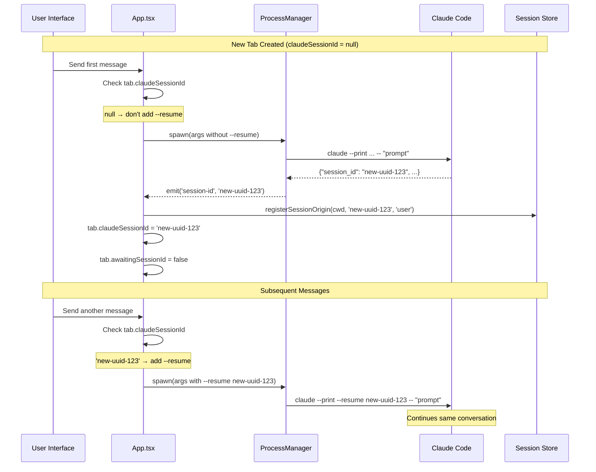

---

## 6. Image Attachment Flow

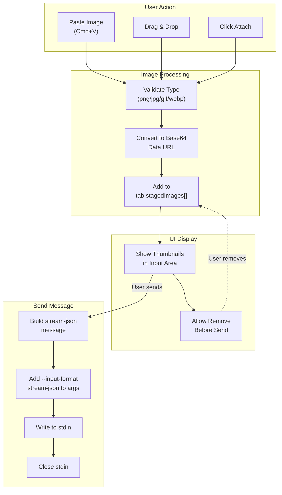

---

## 7. Web/Remote Session Broadcasting

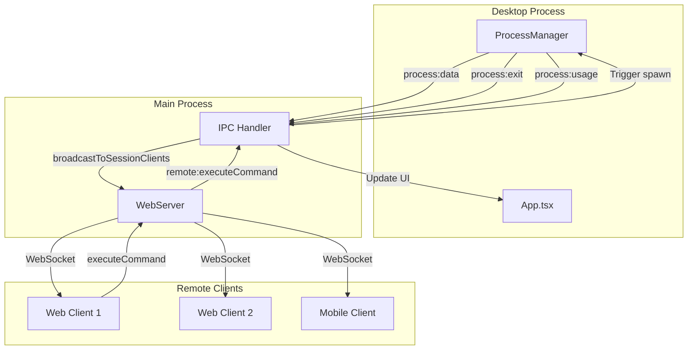

---

## 8. Execution Queue Flow

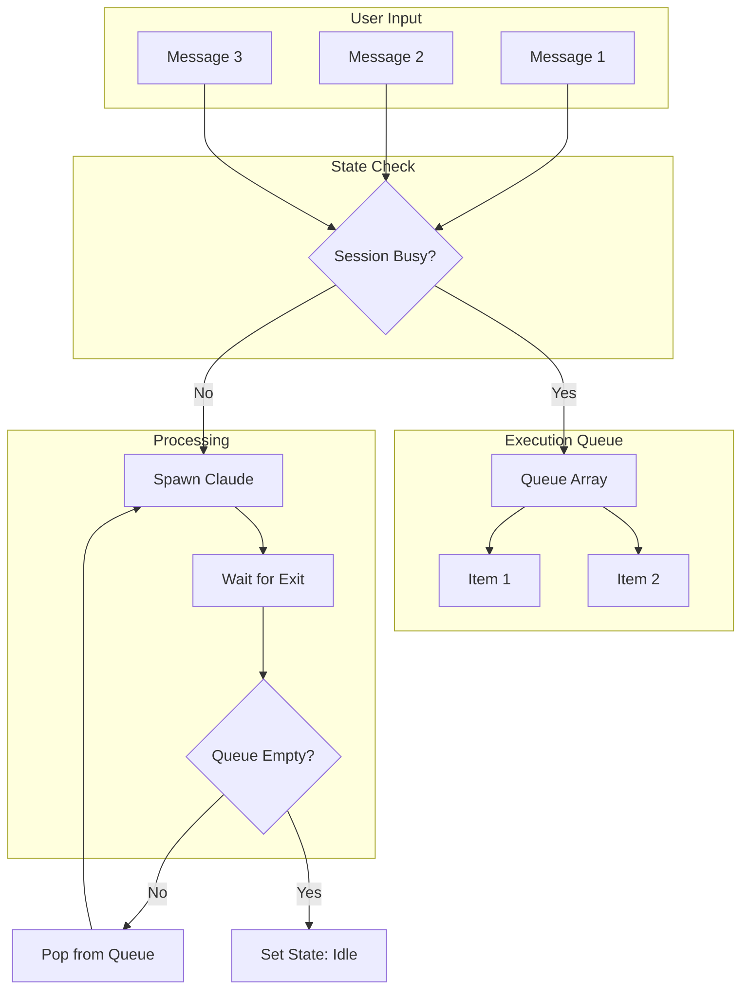

---

## 9. Agent Detection Sequence

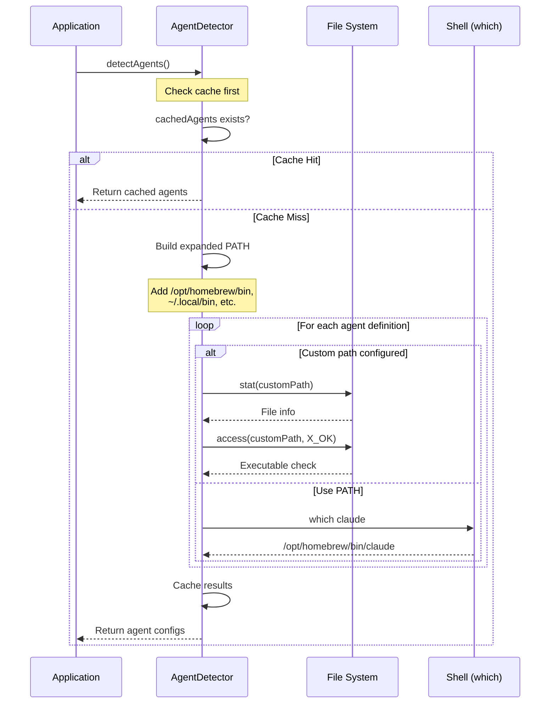

---

## 10. Cost Tracking Data Flow

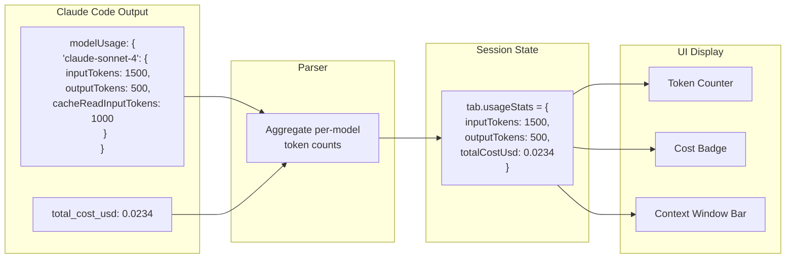

---

## 11. Agentic Orchestration Stack

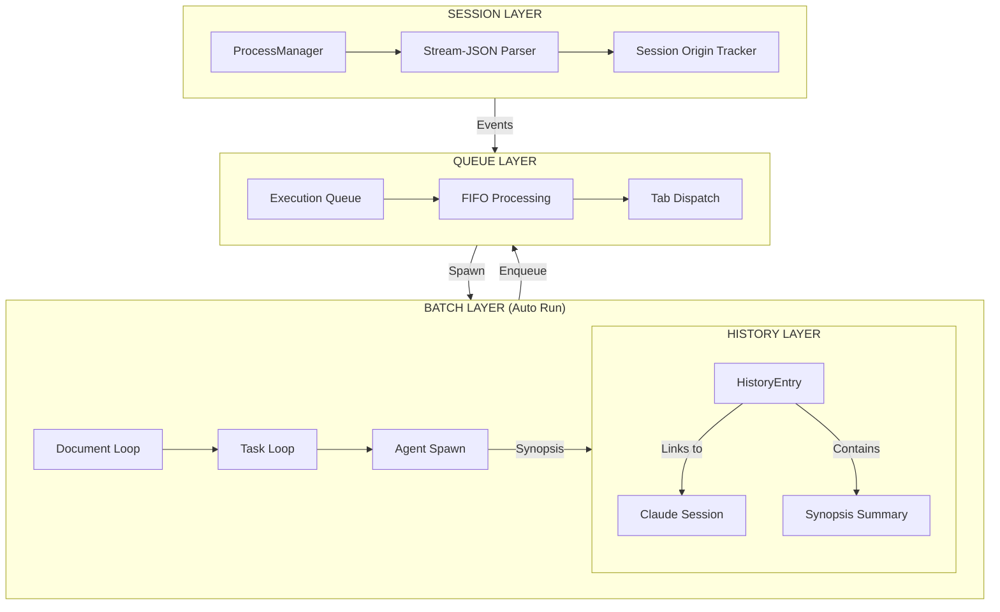

---

## 12. Batch Processing State Machine

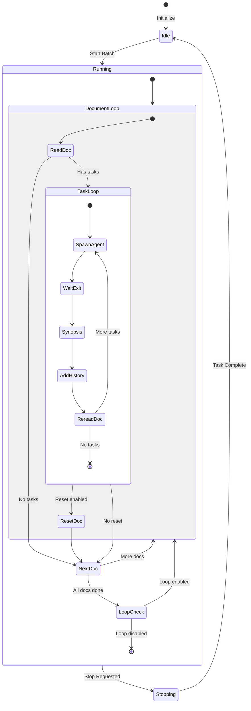

---

## 13. Synopsis Generation Flow

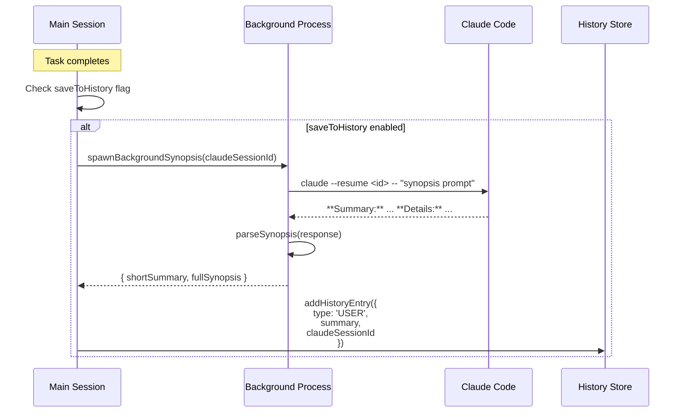

---

## 14. Multi-Tab Parallel Execution

```mermaid
gantt
    title Multi-Tab Execution Timeline
    dateFormat X
    axisFormat %s

    section Tab 1 (Write)
    Task A (Write Mode)    :active, t1a, 0, 20
    Idle                   :t1b, 20, 40
    Task D (Write Mode)    :active, t1d, 40, 60

    section Tab 2 (Read)
    Waiting                :t2a, 0, 5
    Task B (Read-Only)     :active, t2b, 5, 15
    Task E (Read-Only)     :active, t2e, 25, 35

    section Tab 3 (Read)
    Waiting                :t3a, 0, 8
    Task C (Read-Only)     :active, t3c, 8, 18
    Task F (Read-Only)     :active, t3f, 30, 45
```

---

## 15. Session Origin Classification

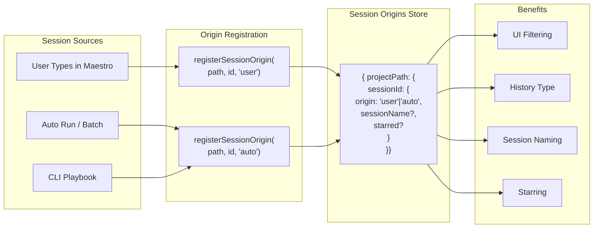

---

## 16. Complete Agentic Flow

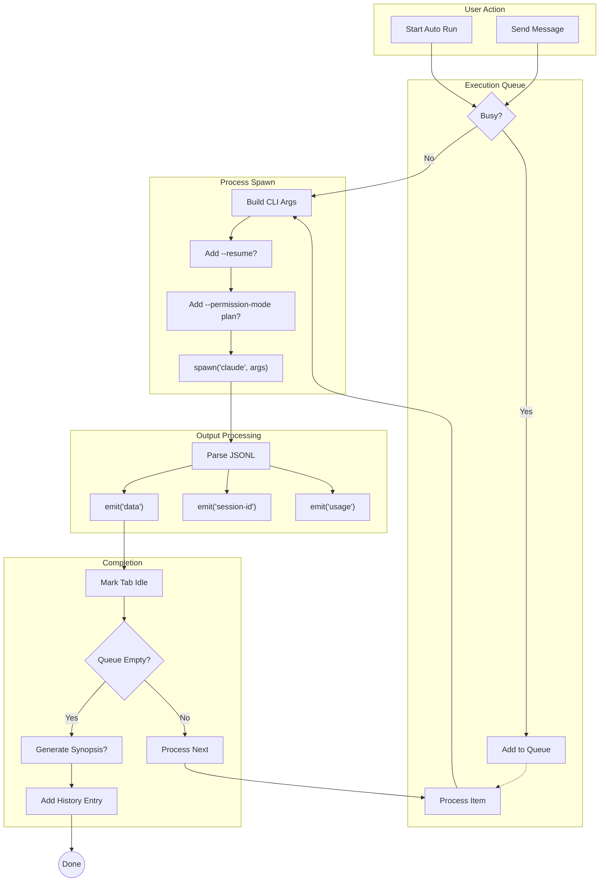

---

## Visual Legend

| Symbol | Meaning |
|--------|---------|
| `[Rectangle]` | Process/Component |
| `{Diamond}` | Decision Point |
| `((Circle))` | Terminal/End State |
| `-->` | Data Flow |
| `-.->` | Optional/Conditional Flow |
| `<-->` | Bidirectional Communication |

---

*Diagrams optimized for Mermaid rendering. Use GitHub preview or Mermaid Live Editor.*
