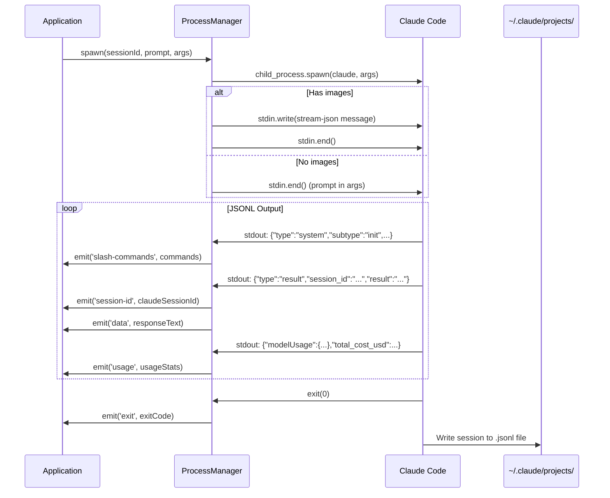
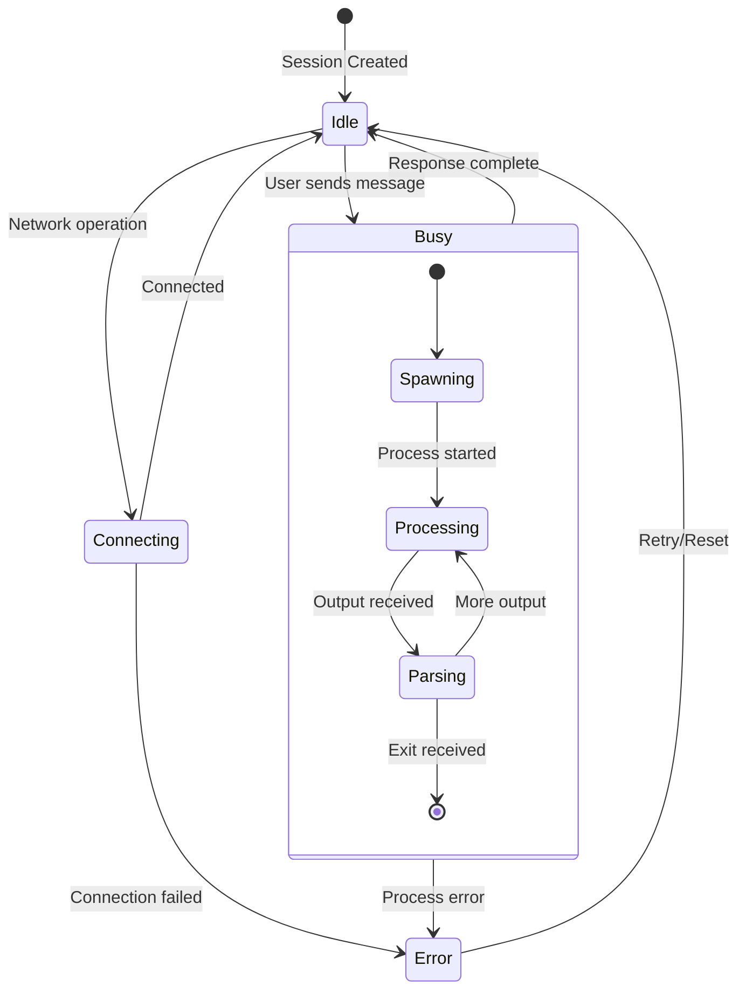

# Claude Code Integration Patterns

> **Purpose**: Reference architecture for integrating with Claude Code CLI. Optimized for AI agent consumption and pattern reuse in new applications.

## Quick Reference

```yaml
Binary: claude
Detection: which claude (expanded PATH for Electron)
Mode: Batch (--print) with stream-json output
Session Continuity: --resume <session-uuid>
Permission Bypass: --dangerously-skip-permissions
Output Format: JSONL (one JSON object per line)
Session Storage: ~/.claude/projects/<encoded-path>/<session-id>.jsonl
```

---

## 1. Core CLI Invocation Pattern

### Standard Command Structure

```bash
claude \
  --print \                              # Batch mode (exit after response)
  --verbose \                            # Detailed output
  --output-format stream-json \          # JSONL output for parsing
  --dangerously-skip-permissions \       # Skip permission prompts
  [--resume <session-uuid>] \            # Continue existing session
  [--permission-mode plan] \             # Read-only mode (optional)
  [--input-format stream-json] \         # Required when sending images
  -- "user prompt here"                  # Prompt as positional arg
```

### Flag Matrix

| Flag | Required | Purpose | When to Use |
|------|----------|---------|-------------|
| `--print` | Yes | Batch mode | Always for non-interactive use |
| `--verbose` | Recommended | Detailed output | Always for debugging/logging |
| `--output-format stream-json` | Yes | Parseable output | Always for programmatic integration |
| `--dangerously-skip-permissions` | Yes* | Skip prompts | Required for autonomous operation |
| `--resume <id>` | No | Session continuity | When continuing a conversation |
| `--permission-mode plan` | No | Read-only mode | For analysis/planning tasks |
| `--input-format stream-json` | No | Structured input | Required for image attachments |

*Required for unattended/autonomous operation

---

## 2. Architecture Diagrams

### 2.1 High-Level Integration Flow

```
┌─────────────────────────────────────────────────────────────────────────────┐
│                           YOUR APPLICATION                                   │
├─────────────────────────────────────────────────────────────────────────────┤
│                                                                              │
│  ┌──────────────┐    ┌──────────────┐    ┌──────────────┐                   │
│  │   Agent      │    │   Process    │    │   Output     │                   │
│  │   Detector   │───▶│   Manager    │───▶│   Parser     │                   │
│  └──────────────┘    └──────────────┘    └──────────────┘                   │
│         │                   │                   │                            │
│         │ detect            │ spawn             │ parse                      │
│         ▼                   ▼                   ▼                            │
│  ┌──────────────┐    ┌──────────────┐    ┌──────────────┐                   │
│  │  Binary      │    │   Child      │    │   Event      │                   │
│  │  Location    │    │   Process    │    │   Emitter    │                   │
│  └──────────────┘    └──────────────┘    └──────────────┘                   │
│                             │                   │                            │
│                             │ stdio             │ events                     │
│                             ▼                   ▼                            │
│                      ┌──────────────┐    ┌──────────────┐                   │
│                      │   Claude     │    │  Session     │                   │
│                      │   Code CLI   │    │  State       │                   │
│                      └──────────────┘    └──────────────┘                   │
│                                                                              │
└─────────────────────────────────────────────────────────────────────────────┘
```

### 2.2 Process Lifecycle (Mermaid)



### 2.3 Session State Machine



### 2.4 Multi-Tab Session Architecture

```
┌─────────────────────────────────────────────────────────────────────────────┐
│                              SESSION                                         │
│  ┌─────────────────────────────────────────────────────────────────────────┐│
│  │ id: "maestro-session-uuid"                                              ││
│  │ cwd: "/path/to/project"                                                 ││
│  │ state: "idle" | "busy" | "error" | "connecting"                         ││
│  └─────────────────────────────────────────────────────────────────────────┘│
│                                                                              │
│  ┌───────────────────┐ ┌───────────────────┐ ┌───────────────────┐          │
│  │      TAB 1        │ │      TAB 2        │ │      TAB 3        │          │
│  │ (Active)          │ │                   │ │                   │          │
│  ├───────────────────┤ ├───────────────────┤ ├───────────────────┤          │
│  │ id: "tab-uuid-1"  │ │ id: "tab-uuid-2"  │ │ id: "tab-uuid-3"  │          │
│  │ claudeSessionId:  │ │ claudeSessionId:  │ │ claudeSessionId:  │          │
│  │   "abc123..."     │ │   "def456..."     │ │   null (new)      │          │
│  │ logs: [...]       │ │ logs: [...]       │ │ logs: []          │          │
│  │ state: "idle"     │ │ state: "busy"     │ │ state: "idle"     │          │
│  │ usageStats: {...} │ │ usageStats: {...} │ │ usageStats: null  │          │
│  └───────────────────┘ └───────────────────┘ └───────────────────┘          │
│                                                                              │
│  Execution Queue: [{ tabId: "tab-uuid-2", text: "pending msg", ... }]       │
└─────────────────────────────────────────────────────────────────────────────┘
```

### 2.5 Session ID Routing Pattern

```
Process Session ID Format:
┌─────────────────────────────────────────────────────────────────┐
│  {maestro-session-id}-{mode}-{identifier}                       │
└─────────────────────────────────────────────────────────────────┘

Examples:
┌─────────────────────────────────────────────────────────────────┐
│ abc123-ai-tab456        → AI output for specific tab            │
│ abc123-terminal         → Terminal output                       │
│ abc123-batch-1699999999 → Background batch task                 │
│ abc123-synopsis-1699999 → Synopsis generation                   │
└─────────────────────────────────────────────────────────────────┘

Extraction Regex:
  sessionId.replace(/-ai-[^-]+$|-terminal$|-batch-\d+$|-synopsis-\d+$/, '')
```

---

## 3. Stream-JSON Output Parsing

### 3.1 Message Types

```typescript
// System init message (first message)
{
  "type": "system",
  "subtype": "init",
  "session_id": "uuid-here",
  "slash_commands": ["/help", "/clear", "/compact", ...]
}

// Streaming assistant message (skip these - prefer result)
{
  "type": "assistant",
  "message": "partial response..."
}

// Final result message (use this for complete response)
{
  "type": "result",
  "result": "Complete response text here",
  "session_id": "uuid-here",
  "modelUsage": {
    "claude-sonnet-4-20250514": {
      "inputTokens": 1500,
      "outputTokens": 500,
      "cacheReadInputTokens": 1000,
      "cacheCreationInputTokens": 200,
      "contextWindow": 200000
    }
  },
  "total_cost_usd": 0.0234
}
```

### 3.2 Parser Implementation Pattern

```typescript
class StreamJsonParser extends EventEmitter {
  private buffer = '';
  private sessionIdEmitted = false;
  private resultEmitted = false;

  processChunk(chunk: string): void {
    this.buffer += chunk;
    const lines = this.buffer.split('\n');
    this.buffer = lines.pop() || ''; // Keep incomplete line

    for (const line of lines) {
      if (!line.trim()) continue;

      try {
        const msg = JSON.parse(line);
        this.handleMessage(msg);
      } catch (e) {
        this.emit('data', line); // Fallback: emit raw
      }
    }
  }

  private handleMessage(msg: any): void {
    // Session ID (emit once)
    if (msg.session_id && !this.sessionIdEmitted) {
      this.sessionIdEmitted = true;
      this.emit('session-id', msg.session_id);
    }

    // Slash commands from init
    if (msg.type === 'system' && msg.subtype === 'init' && msg.slash_commands) {
      this.emit('slash-commands', msg.slash_commands);
    }

    // Result (emit once, prefer over streaming assistant messages)
    if (msg.type === 'result' && msg.result && !this.resultEmitted) {
      this.resultEmitted = true;
      this.emit('data', msg.result);
    }

    // Usage statistics
    if (msg.modelUsage || msg.total_cost_usd !== undefined) {
      this.emit('usage', this.aggregateUsage(msg));
    }
  }

  private aggregateUsage(msg: any): UsageStats {
    let inputTokens = 0, outputTokens = 0;
    let cacheRead = 0, cacheCreation = 0;
    let contextWindow = 200000;

    if (msg.modelUsage) {
      for (const stats of Object.values(msg.modelUsage) as any[]) {
        inputTokens += stats.inputTokens || 0;
        outputTokens += stats.outputTokens || 0;
        cacheRead += stats.cacheReadInputTokens || 0;
        cacheCreation += stats.cacheCreationInputTokens || 0;
        contextWindow = Math.max(contextWindow, stats.contextWindow || 0);
      }
    }

    return {
      inputTokens,
      outputTokens,
      cacheReadInputTokens: cacheRead,
      cacheCreationInputTokens: cacheCreation,
      totalCostUsd: msg.total_cost_usd || 0,
      contextWindow
    };
  }
}
```

---

## 4. Image Input Pattern

### 4.1 Stream-JSON Input Format

When sending images, use `--input-format stream-json` and write to stdin:

```typescript
interface StreamJsonMessage {
  type: 'user';
  message: {
    role: 'user';
    content: Array<ImageContent | TextContent>;
  };
}

interface ImageContent {
  type: 'image';
  source: {
    type: 'base64';
    media_type: 'image/png' | 'image/jpeg' | 'image/gif' | 'image/webp';
    data: string; // Base64 encoded image data (no data URL prefix)
  };
}

interface TextContent {
  type: 'text';
  text: string;
}
```

### 4.2 Implementation

```typescript
function buildImageMessage(prompt: string, images: string[]): string {
  const content: Array<ImageContent | TextContent> = [];

  // Add images first
  for (const dataUrl of images) {
    const match = dataUrl.match(/^data:(image\/[^;]+);base64,(.+)$/);
    if (match) {
      content.push({
        type: 'image',
        source: {
          type: 'base64',
          media_type: match[1] as any,
          data: match[2]
        }
      });
    }
  }

  // Add text prompt last
  content.push({ type: 'text', text: prompt });

  return JSON.stringify({
    type: 'user',
    message: { role: 'user', content }
  });
}

// Usage in spawn
if (hasImages) {
  args.push('--input-format', 'stream-json');
  const process = spawn('claude', args);
  process.stdin.write(buildImageMessage(prompt, images) + '\n');
  process.stdin.end();
}
```

---

## 5. Session Continuity Pattern

### 5.1 Session Resume Flow

```typescript
class SessionManager {
  private claudeSessionIds = new Map<string, string>(); // tabId -> claudeSessionId

  async sendMessage(tabId: string, prompt: string): Promise<void> {
    const args = ['--print', '--verbose', '--output-format', 'stream-json'];

    // Resume existing session if available
    const existingSessionId = this.claudeSessionIds.get(tabId);
    if (existingSessionId) {
      args.push('--resume', existingSessionId);
    }

    args.push('--', prompt);

    const result = await this.spawn('claude', args);

    // Capture new session ID for future resume
    if (!existingSessionId && result.sessionId) {
      this.claudeSessionIds.set(tabId, result.sessionId);
    }
  }
}
```

### 5.2 Session Storage Structure

```
~/.claude/
└── projects/
    └── <encoded-project-path>/
        ├── <session-uuid-1>.jsonl
        ├── <session-uuid-2>.jsonl
        └── <session-uuid-3>.jsonl
```

**Path Encoding**: Project paths are encoded to create valid directory names.

**JSONL Format**: Each line is a JSON object representing a message or event in the conversation.

---

## 6. Agent Detection Pattern

### 6.1 Expanded PATH for Electron/Packaged Apps

Packaged Electron apps don't inherit shell environment. Build expanded PATH:

```typescript
function getExpandedPath(): string {
  const home = os.homedir();
  const additionalPaths = [
    '/opt/homebrew/bin',           // Homebrew Apple Silicon
    '/opt/homebrew/sbin',
    '/usr/local/bin',              // Homebrew Intel / common
    '/usr/local/sbin',
    `${home}/.local/bin`,          // pip, poetry, etc.
    `${home}/.npm-global/bin`,     // npm global
    `${home}/bin`,                 // User bin
    `${home}/.claude/local`,       // Claude local install
    '/usr/bin', '/bin', '/usr/sbin', '/sbin'
  ];

  const currentPath = process.env.PATH || '';
  const parts = new Set(currentPath.split(':'));

  // Prepend additional paths
  return [...additionalPaths.filter(p => !parts.has(p)), ...parts].join(':');
}
```

### 6.2 Binary Detection

```typescript
async function detectClaudeBinary(): Promise<{ available: boolean; path?: string }> {
  const env = { ...process.env, PATH: getExpandedPath() };

  try {
    const { stdout, exitCode } = await execFile('which', ['claude'], { env });
    if (exitCode === 0 && stdout.trim()) {
      return { available: true, path: stdout.trim().split('\n')[0] };
    }
  } catch {}

  return { available: false };
}
```

---

## 7. Reusable Patterns for New Applications

### 7.1 Minimal Integration (Copy-Paste Ready)

```typescript
import { spawn, ChildProcess } from 'child_process';
import { EventEmitter } from 'events';

interface ClaudeResponse {
  text: string;
  sessionId: string;
  usage: {
    inputTokens: number;
    outputTokens: number;
    costUsd: number;
  };
}

async function askClaude(
  prompt: string,
  options: {
    cwd?: string;
    resumeSessionId?: string;
    images?: string[];
    readOnly?: boolean;
  } = {}
): Promise<ClaudeResponse> {
  return new Promise((resolve, reject) => {
    const args = [
      '--print',
      '--verbose',
      '--output-format', 'stream-json',
      '--dangerously-skip-permissions'
    ];

    if (options.resumeSessionId) {
      args.push('--resume', options.resumeSessionId);
    }
    if (options.readOnly) {
      args.push('--permission-mode', 'plan');
    }
    if (options.images?.length) {
      args.push('--input-format', 'stream-json');
    } else {
      args.push('--', prompt);
    }

    const proc = spawn('claude', args, {
      cwd: options.cwd,
      stdio: ['pipe', 'pipe', 'pipe']
    });

    let buffer = '';
    let result: Partial<ClaudeResponse> = {};

    proc.stdout.on('data', (chunk) => {
      buffer += chunk.toString();
      const lines = buffer.split('\n');
      buffer = lines.pop() || '';

      for (const line of lines) {
        if (!line.trim()) continue;
        try {
          const msg = JSON.parse(line);

          if (msg.session_id && !result.sessionId) {
            result.sessionId = msg.session_id;
          }
          if (msg.type === 'result' && msg.result) {
            result.text = msg.result;
          }
          if (msg.total_cost_usd !== undefined) {
            result.usage = {
              inputTokens: 0,
              outputTokens: 0,
              costUsd: msg.total_cost_usd
            };
            if (msg.modelUsage) {
              for (const stats of Object.values(msg.modelUsage) as any[]) {
                result.usage.inputTokens += stats.inputTokens || 0;
                result.usage.outputTokens += stats.outputTokens || 0;
              }
            }
          }
        } catch {}
      }
    });

    proc.on('exit', (code) => {
      if (code === 0 && result.text) {
        resolve(result as ClaudeResponse);
      } else {
        reject(new Error(`Claude exited with code ${code}`));
      }
    });

    // Handle image input
    if (options.images?.length) {
      const content = options.images.map(dataUrl => {
        const match = dataUrl.match(/^data:(image\/[^;]+);base64,(.+)$/);
        return match ? {
          type: 'image',
          source: { type: 'base64', media_type: match[1], data: match[2] }
        } : null;
      }).filter(Boolean);

      content.push({ type: 'text', text: prompt });

      proc.stdin.write(JSON.stringify({
        type: 'user',
        message: { role: 'user', content }
      }) + '\n');
    }

    proc.stdin.end();
  });
}

// Usage
const response = await askClaude('Explain this code', {
  cwd: '/path/to/project',
  resumeSessionId: 'previous-session-uuid' // optional
});
console.log(response.text);
console.log(`Cost: $${response.usage.costUsd}`);
```

### 7.2 Event-Driven Pattern

```typescript
class ClaudeAgent extends EventEmitter {
  private sessions = new Map<string, string>(); // contextId -> claudeSessionId

  async send(contextId: string, prompt: string): Promise<void> {
    const args = this.buildArgs(contextId);
    const proc = this.spawn(args, prompt);

    this.attachHandlers(proc, contextId);
  }

  private buildArgs(contextId: string): string[] {
    const args = ['--print', '--verbose', '--output-format', 'stream-json',
                  '--dangerously-skip-permissions'];

    const sessionId = this.sessions.get(contextId);
    if (sessionId) args.push('--resume', sessionId);

    return args;
  }

  private attachHandlers(proc: ChildProcess, contextId: string): void {
    // ... parsing logic ...

    // Emit events for consumers
    this.emit('response', contextId, responseText);
    this.emit('session-id', contextId, claudeSessionId);
    this.emit('usage', contextId, usageStats);
    this.emit('complete', contextId);
  }
}

// Usage
const agent = new ClaudeAgent();
agent.on('response', (ctx, text) => console.log(text));
agent.on('usage', (ctx, stats) => console.log(`Tokens: ${stats.inputTokens}`));
await agent.send('conversation-1', 'Hello Claude!');
```

---

## 8. Error Handling Patterns

### 8.1 Common Exit Codes

| Code | Meaning | Recovery |
|------|---------|----------|
| 0 | Success | N/A |
| 1 | General error | Check stderr, retry |
| 2 | Invalid arguments | Fix args, don't retry |
| 130 | SIGINT (Ctrl+C) | User cancelled, don't retry |

### 8.2 Graceful Interruption

```typescript
function interrupt(proc: ChildProcess): void {
  // Send SIGINT for graceful stop
  proc.kill('SIGINT');

  // Force kill after timeout
  setTimeout(() => {
    if (!proc.killed) {
      proc.kill('SIGTERM');
    }
  }, 5000);
}
```

---

## 9. Performance Considerations

### 9.1 Token Extraction Optimization

For reading session files, use regex instead of JSON.parse per line:

```typescript
function extractTokenCounts(content: string): { input: number; output: number } {
  let input = 0, output = 0;

  for (const match of content.matchAll(/"input_tokens"\s*:\s*(\d+)/g)) {
    input += parseInt(match[1], 10);
  }
  for (const match of content.matchAll(/"output_tokens"\s*:\s*(\d+)/g)) {
    output += parseInt(match[1], 10);
  }

  return { input, output };
}
```

### 9.2 Session Listing Performance

- Use pagination for projects with many sessions
- Cache session metadata
- Use file modification time for sorting without parsing

---

## 10. Security Considerations

### 10.1 Command Injection Prevention

```typescript
// ALWAYS use spawn with explicit args array - NEVER shell: true
spawn('claude', ['--print', '--', userPrompt], { shell: false });

// NEVER do this:
// spawn(`claude --print -- "${userPrompt}"`, { shell: true }); // VULNERABLE
```

### 10.2 Path Validation

```typescript
function validateProjectPath(path: string): boolean {
  // Prevent path traversal
  const resolved = path.resolve(path);
  return !resolved.includes('..') && resolved.startsWith(os.homedir());
}
```

---

## Appendix A: TypeScript Interfaces

```typescript
interface UsageStats {
  inputTokens: number;
  outputTokens: number;
  cacheReadInputTokens: number;
  cacheCreationInputTokens: number;
  totalCostUsd: number;
  contextWindow: number;
}

interface AITab {
  id: string;
  claudeSessionId: string | null;
  name: string | null;
  starred: boolean;
  logs: LogEntry[];
  inputValue: string;
  stagedImages: string[];
  usageStats?: UsageStats;
  state: 'idle' | 'busy';
  readOnlyMode?: boolean;
  awaitingSessionId?: boolean;
}

interface ProcessConfig {
  sessionId: string;
  toolType: string;
  cwd: string;
  command: string;
  args: string[];
  prompt?: string;
  images?: string[];
}

interface ClaudeSessionInfo {
  sessionId: string;
  firstMessage: string;
  messageCount: number;
  costUsd: number;
  modifiedAt: number;
  fileSize: number;
}
```

---

## Appendix B: File Reference

| File | Purpose |
|------|---------|
| `src/main/process-manager.ts` | Process spawning and output parsing |
| `src/main/agent-detector.ts` | Binary detection with expanded PATH |
| `src/main/index.ts` | IPC handlers, session storage APIs |
| `src/main/preload.ts` | Exposed IPC bridge |
| `src/renderer/App.tsx` | UI state management, event handlers |
| `src/renderer/utils/tabHelpers.ts` | Multi-tab operations |
| `src/renderer/types/index.ts` | TypeScript interfaces |

---

*Document generated for pattern reuse. Optimized for AI agent consumption.*
